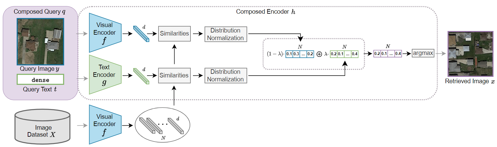
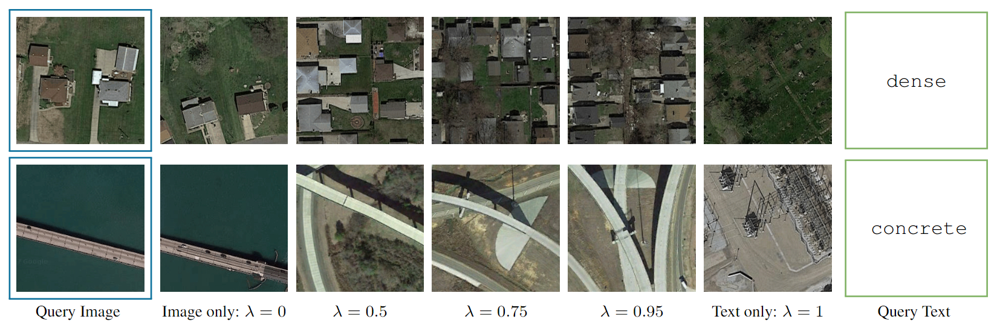
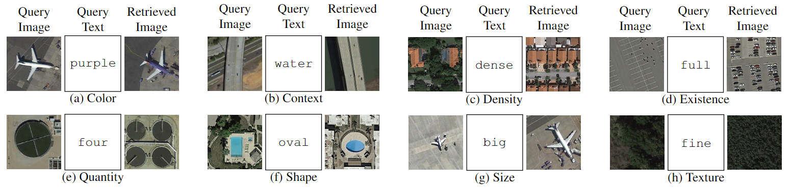

# Composed Image Retrieval for Remote Sensing

Official PyTorch implementation and benchmark dataset for IGARSS 2024 ORAL paper. [[`arXiv`](https://arxiv.org/abs/2405.15587)]


[](https://paperswithcode.com/sota/composed-image-retrieval-coir-on-pattercom?p=composed-image-retrieval-for-remote-sensing)

<div align="center">
  
</div>

## Overview

### Motivation

In recent years, earth observation (EO) through remote sensing (RS) has witnessed an enormous growth in data volume, creating a challenge in managing and extracting relevant information. Remote sensing image retrieval (RSIR), which aims to search and retrieve images from RS image archives, has emerged as a key solution. However, RSIR methods encounter a major limitation:
the reliance on a query of single modality. This constraint often restricts users from fully expressing their specific requirements. 

### Approach

To tackle this constraint, we introduce a new task, remote sensing composed image retrieval. RSCIR, integrating both image and text in the search query, is designed to retrieve images that are not only visually similar to the query image but also relevant to the details of the accompanying query text. Our RSCIR approach, called WeiCom, is expressive, flexible and training-free based on a vision-language model, utilizing a weighting parameter λ for more image- or text-oriented results, with λ → 0 or λ → 1 respectively.

<div align="center">
  
</div>

In this work, we recognize, present and qualitatively evaluate the capabilities and challenges of RSCIR. We demonstrate how users can now pair a query image with a query text specifying modifications related to color, context, density, existence, quantity, shape, size or texture of one or more classes.

<div align="center">
  
</div>

Quantitatively, we focus on color, context, density, existence, quantity, and shape
modifications, establishing a new benchmark dataset, called PatterCom and an evaluation protocol.

### Contributions

In summary, we make the following contributions:
- We introduce remote sensing composed image retrieval (RSCIR), accompanied with PatterCom, a new benchmark dataset.
- We introduce WeiCom, a training-free method utilizing a modality control parameter for more image- or text-oriented results according to the needs of each search.
- We evaluate both qualitatively and quantitatively the performance of WeiCom, setting the state-of-the-art on RSCIR.

## Pre-trained models

For our experiments, you need to download [CLIP](https://drive.google.com/file/d/1F9Kk7PZXhkv1KkCN0CCrctE5nnS1DmUv/view?usp=sharing) and [RemoteCLIP](https://drive.google.com/file/d/1zAqlxASKvNTFQB-ftf6Wn42nFX5IeTKB/view?usp=sharing), both with a ViT-L/14 image encoder. After downloading, place them inside the `models/` folder.

This code folder structure should then look like this:

```
rscir/
    |-- .github/
    |-- models/
        |-- CLIP-ViT-L-14.bin
        |-- RemoteCLIP-ViT-L-14.pt
    |-- .gitignore
    |-- LICENSE
    |-- README.md
    |-- evaluate.py
    |-- extract_features.py
    |-- utils.py
```

## Environment

Create this environment for our experiments:

```bash
conda create -n rscir python=3.9 -y
conda activate rscir
conda install pytorch torchvision torchaudio pytorch-cuda=11.8 -c pytorch -c nvidia
pip install open_clip_torch
```

## Dataset

PatterCom is based on [PatterNet](https://sites.google.com/view/zhouwx/dataset), a large-scale, high-resolution remote sensing dataset that comprises 38 classes, with each class containing 800 images of 256×256 pixels. 

Download PatterNet from [here](https://nuisteducn1-my.sharepoint.com/:u:/g/personal/zhouwx_nuist_edu_cn/EYSPYqBztbBBqS27B7uM_mEB3R9maNJze8M1Qg9Q6cnPBQ?e=MSf977) and unzip it into `PatterNet/` folder. Download `patternnet.csv` for [here](https://drive.google.com/file/d/1sIdH0DVR2JxCEYQgp8041sUOYfLdGgyV/view?usp=sharing) and place it in the same folder too. Finally, download PatternCom from [here](https://drive.google.com/drive/folders/1NP2Ryj4V2L_wwInQB6HjzPDPRH2k0J5U?usp=sharing) and place it into the same folder too.

The `PatterNet/` folder structure should look like this:

```
PatterNet/
    |-- images/
    |-- PatternCom/
        |-- color.csv
        |-- context.csv
        |-- density.csv
        |-- existence.csv
        |-- quantity.csv
        |-- shape.csv
    |-- patternnet.csv
    |-- patternnet_description.pdf
```

## Feature Extraction

To extract CLIP or RemoteCLIP features from PatternNet dataset, run:

```python
python extract_features.py --model_name clip --dataset_path /path/to/PatternNet/
```

Replace `clip` with `remoteclip` for RemoteCLIP features.

Note that this will save features as pickle files inside `PatterNet/features/` folder. Thus, the new folder structure should look like this:

```
PatterNet/
    |-- features/
        |-- patternnet_clip.pkl
        |-- patternnet_remoteclip.pkl
    |-- images/
    |-- PatternCom/
    |-- patternnet.csv
    |-- patternnet_description.pdf
```

## Evaluation

### Baselines

To evaluate extracted features on PatternCom RSCIR using baselines, run:

```python
python evaluate.py --model_name clip --dataset_path /path/to/PatternNet/ --methods "Image only" "Text only" "Average Similarities"
```

Replace `clip` with `remoteclip` for RemoteCLIP features.

### WeiCom

To evaluate extracted features on PatternCom RSCIR using WeiCom, run:

```python
python evaluate.py --model_name clip --dataset_path /path/to/PatternNet/ --methods "Weighted Similarities Norm" --lambdas 0.5
```

Replace `clip` with `remoteclip` for RemoteCLIP features. 

Following our ablation, you can use optimal `--lambdas 0.3` for CLIP, `--lambdas 0.6` for RemoteCLIP. 

### Results

Running the code as described above, you should get the following results. In these tables, for each attribute value of an attribute (e.g. "rectangular" of Shape), the average mAP over all the rest attribute values (e.g. "oval" of Shape) is shown. `Avg` represents the average mAP over all combinations.

#### CLIP

| **Method**               | **Color** | **Context** | **Density** | **Existence** | **Quantity** | **Shape** | **Avg** |
|--------------------------|:---------:|:-----------:|:-----------:|:-------------:|:------------:|:---------:|:-------:|
| Text                     | 13.47     | 4.83        | 3.58        | 4.38          | 3.31         | 6.22      | 5.97    |
| Image                    | 14.66     | 8.32        | 13.49       | 13.50         | 7.84         | 15.76     | 12.26   |
| Text & Image             | 23.13     | 11.02       | 15.87       | **13.77**     | 10.13        | 21.38     | 15.88   |
| **$WeiCom_{\lambda=0.5}$** | 46.08     | 17.45       | 16.49       | 9.24          | 18.15        | 23.97     | 21.90   |
| **$WeiCom_{\lambda=0.3}$** | **46.74** | **20.97**   | **22.07**   | 12.07         | **20.96**    | **26.22** | **24.83** |

#### RemoteCLIP

| **Method**               | **Color** | **Context** | **Density** | **Existence** | **Quantity** | **Shape** | **Avg** |
|--------------------------|:---------:|:-----------:|:-----------:|:-------------:|:------------:|:---------:|:-------:|
| Text                     | 10.75     | 8.87        | 22.16       | 12.49         | 8.25         | 24.12     | 14.44   |
| Image                    | 14.40     | 6.62        | 15.11       | 9.29          | 6.99         | 15.18     | 11.27   |
| Text & Image             | 23.67     | 10.01       | 18.45       | 10.56         | 7.97         | 19.63     | 15.05   |
| **$WeiCom_{\lambda=0.5}$** | **43.68** | 31.45       | 39.94       | 14.27         | 20.51        | 29.78     | 29.94   |
| **$WeiCom_{\lambda=0.6}$** | 41.04     | **31.59**   | **41.56**   | **14.79**     | **20.79**    | **31.24** | **30.19** |

## Acknowledgement
[NTUA](https://www.ntua.gr/en/) thanks [NVIDIA](https://www.nvidia.com/en-us/) for the support with the donation of GPU hardware.

## License
This repository is released under the Apache 2.0 license as found in the [LICENSE](LICENSE) file.

## Citation
If you find this repository useful, please consider giving a star 🌟 and citation:
```
@inproceedings{psomas2024composed,
      title={Composed Image Retrieval for Remote Sensing}, 
      author={Psomas, B. and Kakogeorgiou, I. and Efthymiadis, N. and Tolias, G. and Chum, O. and Avrithis, Y. and Karantzalos, K.},
      booktitle={IGARSS 2024 - 2024 IEEE International Geoscience and Remote Sensing Symposium}, 
      year={2024}
}
```